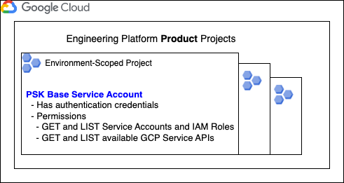
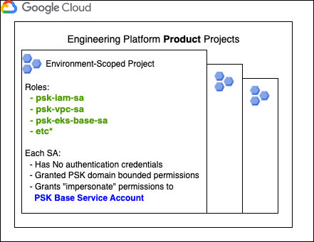

	

		 
		 
		<h2>lab-gcp-iam-profiles</h2>
		 
	

Go [here](https://github.com/ThoughtWorks-DPS/psk-gcp-documentation/blob/master/doc/architecture.md) for the architectural overview of an GCP-based Engineering Platform.  

This pipeline manages:   

**Product service accounts**  
One base service account (machine user) is defined per environment-scoped project for use in the Engineering Platform teams GCP pipelines. Login credentials are generated for this account and stored in the secret store, and rotated on a regular basis.  The base service account is only granted permission to get and list other service accounts and IAM roles in the project it is scoped to along with what Google Cloud APIs it is allowed to access.  No other permissions are granted.

main.tf

**Pipeline Service Accounts (permissions)**  

One service account (per environment-scoped project) is then created with limited permissions based on the GCP API functions neccesary to provision resources of a PSK domain boundary.  No credentials are generated so that these service accounts can not be directly authenticated to. Permissions are defined that allow the PSK Base service account to _impersonate_ these accounts for a limited period of time, effectively giving a pipeline only the permissions it needs to complete.

Each pipeline service account has a matching, named `sa_role` file.  

### About access permissions  

In general, it is only the Engineering Platform product development team(s) that will have direct access to the environment scope Projects. Customers of the platform will not have GCP identities authorized to access projects and resources directluy, but rather will have access defined and maintained as part of the overall product capabilities, through an external idp.  

Even though EP product team members have direct access, apart from the Development project, you should not expect to see actual human write-access taking place. All change is brought about through software-defined process and via a service account persona.  

> NOTE: It is possible to create ubiquitous project-scoped service accounts that do not have authentication credentials and grant impersonation permissions only to a base role defined in a central "state" account.  This will increase security in environment level projects as there will not be a defined account that can directly authenticate to the project.  In that case, the organization must allow the Base role to query Service Accounts and Roles across projects, effectivly organization-scoping that role.  We have made the assumption that the organization this PSK will be deployed in will not allow those permissions, as typically the team deploying the PSK is not the only user of GCP in the tenant.

Maintainer notes found [here](doc/maintainer_notes.md).
